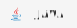

<!--

    

-->

    

<h4 align="center">
    Computer Science and Software Engineering Student 👨🏽‍💻
</h4>
<h4 align="center">
    Tech enthusiast with a curious mind ⚡
</h4>

 

<!-- Previous colors: Email D14836, LinkedIn 0077B5 -->

    
    
     
    
    
     
    
    
    <!--
    
    -->
    <!--
    
    -->

 

<blockquote align="left" width="200">
    Ideas are the rain in the desert of creativity: sometimes you need an umbrella to avoid getting soaked ☔
</blockquote>

 

🧠 **Currently learning:**  `Cryptography 🔐`  

💡 **Interested in:**  `Mobile Development 📱` `UX Design 👤` `Data Science 🧪` `Machine Learning & AI 🤖` `Cybersecurity 🔒` `Web Development 🌐`

<!--
## ⚡ My Skill Set

    <picture>
        <source media="(prefers-color-scheme: light)" srcset="https://cdn.jsdelivr.net/gh/devicons/devicon/icons/html5/html5-original-wordmark.svg" width="48" height="48" />
        
    </picture>
    <picture>
        <source media="(prefers-color-scheme: light)" srcset="https://cdn.jsdelivr.net/gh/devicons/devicon/icons/css3/css3-original-wordmark.svg" width="48" height="48" />
        <source media="(prefers-color-scheme: dark)" srcset="https://cdn.jsdelivr.net/gh/devicons/devicon/icons/css3/css3-original.svg" width="48" height="48" />
        
    </picture>
    
    
    <picture>
        <source media="(prefers-color-scheme: light)" srcset="https://cdn.jsdelivr.net/gh/devicons/devicon/icons/jquery/jquery-original-wordmark.svg" width="48" height="48" />
        <source media="(prefers-color-scheme: dark)" srcset="https://cdn.jsdelivr.net/gh/devicons/devicon/icons/jquery/jquery-original.svg" width="48" height="48" />
        
    </picture>
    
    
    
    
    
    
    
    

-->

## 💻 Tech Stack

#### Languages

    <picture>
        <source media="(prefers-color-scheme: dark)" srcset="https://img.shields.io/badge/HTML5-212121?style=for-the-badge&logo=html5&logoColor=E34F26" height="32" />
        <source media="(prefers-color-scheme: light)" srcset="https://img.shields.io/badge/HTML5-F5F5F5?style=for-the-badge&logo=html5&logoColor=E34F26" height="32" />
        
    </picture>
    <picture>
        <source media="(prefers-color-scheme: dark)" srcset="https://img.shields.io/badge/CSS3-212121?style=for-the-badge&logo=css3&logoColor=1572B6" height="32" />
        <source media="(prefers-color-scheme: dark)" srcset="https://img.shields.io/badge/CSS3-F5F5F5?style=for-the-badge&logo=css3&logoColor=1572B6" height="32" />
        
    </picture>
    <picture>
        <source media="(prefers-color-scheme: dark)" srcset="https://img.shields.io/badge/JavaScript-212121?style=for-the-badge&logo=javascript&logoColor=F7DF1E" height="32" />
        <source media="(prefers-color-scheme: light)" srcset="https://img.shields.io/badge/JavaScript-F5F5F5?style=for-the-badge&logo=javascript&logoColor=F7DF1E" height="32" />
        
    </picture>
    <picture>
        <source media="(prefers-color-scheme: dark)" srcset="https://img.shields.io/badge/PHP-212121?style=for-the-badge&logo=php&logoColor=777BB4" height="32" />
        <source media="(prefers-color-scheme: light)" srcset="https://img.shields.io/badge/PHP-F5F5F5?style=for-the-badge&logo=php&logoColor=777BB4" height="32" />
        
    </picture>
    <picture>
        <source media="(prefers-color-scheme: dark)" srcset="assets/Java-212121.svg" height="32" />
        <source media="(prefers-color-scheme: light)" srcset="assets/Java-F5F5F5.svg" height="32" />
        
    </picture>
    <picture>
        <source media="(prefers-color-scheme: dark)" srcset="assets/Python-212121.svg" height="32" />
        <source media="(prefers-color-scheme: light)" srcset="assets/Python-F5F5F5.svg" height="32" />
        
    </picture>
    <picture>
        <source media="(prefers-color-scheme: dark)" srcset="assets/MATLAB-212121.svg" height="32" />
        <source media="(prefers-color-scheme: light)" srcset="assets/MATLAB-F5F5F5.svg" height="32" />
        
    </picture>
    <picture>
        <source media="(prefers-color-scheme: dark)" srcset="https://img.shields.io/badge/C-212121?style=for-the-badge&logo=c&logoColor=00599C" height="32" />
        <source media="(prefers-color-scheme: light)" srcset="https://img.shields.io/badge/C-F5F5F5?style=for-the-badge&logo=c&logoColor=00599C" height="32" />
        
    </picture>
    <picture>
        <source media="(prefers-color-scheme: dark)" srcset="https://img.shields.io/badge/C%23-212121?style=for-the-badge&logo=c-sharp&logoColor=512BD4" height="32" />
        <source media="(prefers-color-scheme: light)" srcset="https://img.shields.io/badge/C%23-F5F5F5?style=for-the-badge&logo=c-sharp&logoColor=512BD4" height="32" />
        
    </picture>
    <picture>
        <source media="(prefers-color-scheme: dark)" srcset="https://img.shields.io/badge/Markdown-212121?style=for-the-badge&logo=markdown&logoColor=white" height="32" />
        <source media="(prefers-color-scheme: light)" srcset="https://img.shields.io/badge/Markdown-F5F5F5?style=for-the-badge&logo=markdown&logoColor=black" height="32" />
        
    </picture>
    <picture>
        <source media="(prefers-color-scheme: dark)" srcset="https://img.shields.io/badge/Shell_Script-212121?style=for-the-badge&logo=gnu-bash&logoColor=4EAA25" height="32" />
        <source media="(prefers-color-scheme: light)" srcset="https://img.shields.io/badge/Shell_Script-F5F5F5?style=for-the-badge&logo=gnu-bash&logoColor=4EAA25" height="32" />
        
    </picture>
    <picture>
        <source media="(prefers-color-scheme: dark)" srcset="https://img.shields.io/badge/Assembly_Script-212121?style=for-the-badge&logo=assemblyscript&logoColor=007AAC" height="32" />
        <source media="(prefers-color-scheme: light)" srcset="https://img.shields.io/badge/Assembly_Script-F5F5F5?style=for-the-badge&logo=assemblyscript&logoColor=007AAC" height="32" />
        
    </picture>

#### Frameworks · Libraries · Pre-processors

    <picture>
        <source media="(prefers-color-scheme: dark)" srcset="https://img.shields.io/badge/jQuery-212121?style=for-the-badge&logo=jquery&logoColor=0769AD" height="32" />
        <source media="(prefers-color-scheme: light)" srcset="https://img.shields.io/badge/jQuery-F5F5F5?style=for-the-badge&logo=jquery&logoColor=0769AD" height="32" />
        
    </picture>
    <picture>
        <source media="(prefers-color-scheme: dark)" srcset="https://img.shields.io/badge/Sass-212121?style=for-the-badge&logo=sass&logoColor=CC6699" height="32" />
        <source media="(prefers-color-scheme: light)" srcset="https://img.shields.io/badge/Sass-F5F5F5?style=for-the-badge&logo=sass&logoColor=CC6699" height="32" />
        
    </picture>
    <picture>
        <source media="(prefers-color-scheme: dark)" srcset="assets/JavaFX-212121.svg" height="32" />
        <source media="(prefers-color-scheme: light)" srcset="assets/JavaFX-F5F5F5.svg" height="32" />
        
    </picture>
    <picture>
        <source media="(prefers-color-scheme: dark)" srcset="https://img.shields.io/badge/Junit5-212121?style=for-the-badge&logo=junit5&logoColor=25A162" height="32" />
        <source media="(prefers-color-scheme: light)" srcset="https://img.shields.io/badge/Junit5-F5F5F5?style=for-the-badge&logo=junit5&logoColor=25A162" height="32" />
        
    </picture>
    <picture>
        <source media="(prefers-color-scheme: dark)" srcset="https://img.shields.io/badge/NUnit3-212121?style=for-the-badge&logo=nuget&logoColor=004880" height="32" />
        <source media="(prefers-color-scheme: light)" srcset="https://img.shields.io/badge/NUnit3-F5F5F5?style=for-the-badge&logo=nuget&logoColor=004880" height="32" />
        
    </picture>

#### Database

    <picture>
        <source media="(prefers-color-scheme: dark)" srcset="https://img.shields.io/badge/MySQL-212121?style=for-the-badge&logo=mysql&logoColor=4479A1" height="32" />
        <source media="(prefers-color-scheme: light)" srcset="https://img.shields.io/badge/MySQL-F5F5F5?style=for-the-badge&logo=mysql&logoColor=4479A1" height="32" />
        
    </picture>

#### Backend Tools

    <picture>
        <source media="(prefers-color-scheme: dark)" srcset="https://img.shields.io/badge/Xampp-212121?style=for-the-badge&logo=xampp&logoColor=FB7A24" height="32" />
        <source media="(prefers-color-scheme: light)" srcset="https://img.shields.io/badge/Xampp-F5F5F5?style=for-the-badge&logo=xampp&logoColor=FB7A24" height="32" />
        
    </picture>
    <picture>
        <source media="(prefers-color-scheme: dark)" srcset="https://img.shields.io/badge/PHPMyAdmin-212121?style=for-the-badge&logo=phpmyadmin&logoColor=6C78AF" height="32" />
        <source media="(prefers-color-scheme: light)" srcset="https://img.shields.io/badge/PHPMyAdmin-F5F5F5?style=for-the-badge&logo=phpmyadmin&logoColor=6C78AF" height="32" />
        
    </picture>

#### Version Control

    <picture>
        <source media="(prefers-color-scheme: dark)" srcset="https://img.shields.io/badge/Git-212121?style=for-the-badge&logo=git&logoColor=F05032" height="32" />
        <source media="(prefers-color-scheme: light)" srcset="https://img.shields.io/badge/Git-F5F5F5?style=for-the-badge&logo=git&logoColor=F05032" height="32" />
        
    </picture>
    <picture>
        <source media="(prefers-color-scheme: dark)" srcset="https://img.shields.io/badge/GitHub-212121?style=for-the-badge&logo=github&logoColor=white" height="32" />
        <source media="(prefers-color-scheme: light)" srcset="https://img.shields.io/badge/GitHub-F5F5F5?style=for-the-badge&logo=github&logoColor=181717" height="32" />
        
    </picture>

## 📈 GitHub Stats

    

        <picture>
            <source media="(prefers-color-scheme: light)" srcset="https://github-readme-stats.vercel.app/api?username=Val0rous&count_private=true&show_icons=true&rank_icon=github&theme=buefy&bg_color=00000000&hide_border=true" width="500" />
            <source media="(prefers-color-scheme: dark)" srcset="https://github-readme-stats.vercel.app/api?username=Val0rous&count_private=true&show_icons=true&rank_icon=github&theme=tokyonight&bg_color=00000000&hide_border=true" width="500" />
            
        </picture>
    

    

        <picture>
            <source media="(prefers-color-scheme: light)" srcset="https://github-readme-stats.vercel.app/api/top-langs/?username=Val0rous&size_weight=0.5&count_weight=0.5&langs_count=6&layout=compact&theme=buefy&bg_color=00000000&hide_border=true" width="500" />
            <source media="(prefers-color-scheme: dark)" srcset="https://github-readme-stats.vercel.app/api/top-langs/?username=Val0rous&size_weight=0.5&count_weight=0.5&langs_count=6&layout=compact&theme=tokyonight&bg_color=00000000&hide_border=true" width="500" />
            
        </picture>
    

    <!--
    

        <picture>
            <source media="(prefers-color-scheme: light)" srcset="https://github-profile-summary-cards.vercel.app/api/cards/profile-details?username=Val0rous&theme=vue" width="500" />
            <source media="(prefers-color-scheme: dark)" srcset="https://github-profile-summary-cards.vercel.app/api/cards/profile-details?username=Val0rous&theme=tokyonight" width="500" />
            
        </picture>
    

    -->
    <!--
    

        <picture>
            <source media="(prefers-color-scheme: light)" srcset="http://github-profile-summary-cards.vercel.app/api/cards/repos-per-language?username=Val0rous&theme=vue" width="500" />
            <source media="(prefers-color-scheme: dark)" srcset="http://github-profile-summary-cards.vercel.app/api/cards/repos-per-language?username=Val0rous&theme=tokyonight" width="500" />
            
        </picture>
    

    -->

## 🏆 GitHub Trophies

    <picture>
        <source media="(prefers-color-scheme: light)" srcset="https://github-profile-trophy.vercel.app/?username=Val0rous&theme=flat&column=4&margin-w=15&margin-h=15&no-frame=true" width="100%" />
        <source media="(prefers-color-scheme: dark)" srcset="https://github-profile-trophy.vercel.app/?username=Val0rous&theme=discord&column=4&margin-w=15&margin-h=15&no-frame=true" width="100%" />
        
    </picture>

---

    

<!--- light theme: buefy --->
<!--- dark theme: tokyonight --->
<!--- former background gradient: bg_color=30,e96443,904e95&title_color=fff&text_color=fff&icon_color=fff --->

<!---

     
    

--->

<!--# 📱 Connect with me-->

<!---
- 👋 Hi, I’m @Val0rous
- 👀 I’m interested in ...
- 🌱 I’m currently learning ...
- 💞️ I’m looking to collaborate on ...
- 📫 How to reach me ...
--->

<!---
Val0rous/Val0rous is a ✨ special ✨ repository because its `README.md` (this file) appears on your GitHub profile.
You can click the Preview link to take a look at your changes.
--->
